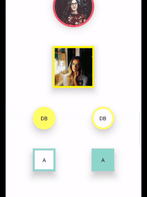
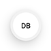

# react-native-image-avatars

A simple and fully customizable React Native component that displays avatars for images & text. 

Features             |  Visual Effects
:-------------------------:|:-------------------------:
<b>* Rounded & Square shaped avatars</b><br/><b>* Avatars with border colors</b><br/><b>* Avatars for textual data (slices initial character of the word automatically)</b> | 


## Installation

If using yarn:

```
yarn add react-native-image-avatars
```

If using npm:

```
npm i react-native-image-avatars
```

## Usage

```
import { Avatar } from 'react-native-image-avatars';
```


```
<Avatar
  imageUrl = 'https://images.pexels.com/photos/220453/pexels-photo-220453.jpeg?auto=compress&cs=tinysrgb&dpr=1&w=500'
  size="small"
  borderColor = "#f2f2f2"
  shadow
/>
``` 


```
<Avatar
  type = 'text'
  text='Davis Benton'
  size="x-small"
  borderColor = "#f2f2f2"
  textBackgroundFill = '#fff'
  shadow
/>
``` 
## Documentation

### Component Props Reference


| Name                      | Description                              | Default     | Type   |
|---------------------------|------------------------------------------|-------------|--------|
| type                      | 'image' or 'text'  | image           | String |
| imageUrl               | URL of the image      | none       | String |
| shadow | Shadow effect: elevation {15} for android & equivalent for IOS | true     | Boolean |
| size | Values: 'x-small', 'small', 'medium', 'large' or 'x-large' |   small   | String |
| shape | Values: 'circle' or 'square' |   circle   | String |
| text | Extracts initials of each word (upto 2 slices max). Example: text='David Benton Woods' would eventually display 'DB' |   none   | String |
| borderColor | Border to the shape with color specified |   none   | String |
| textBackgroundFill | Background color for text avatar  |   #C0C0C0   | String |


## Contributing
Pull requests are always welcome! Feel free to open a new GitHub issue for any changes that can be made.

**Working on your first Pull Request?** You can learn how from this *free* series [How to Contribute to an Open Source Project on GitHub](https://egghead.io/series/how-to-contribute-to-an-open-source-project-on-github)

## Author
Saurabh Kataria | Freelance Developer

Looking for a full-time or part-time remote-based developer. 
Checkout my UpWork Profile:
[https://www.upwork.com/fl/saurabhkataria6](https://www.upwork.com/fl/saurabhkataria6)

## License
[MIT](./LICENSE)